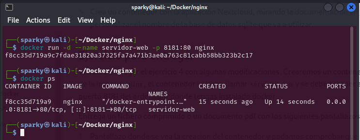
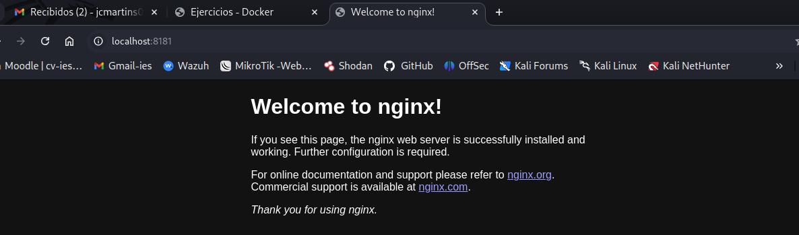
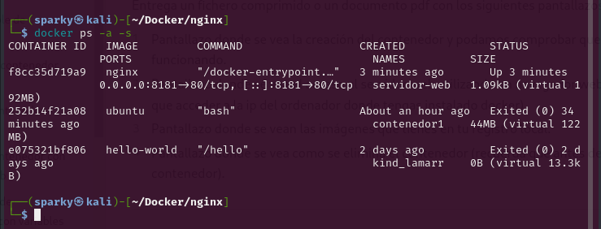
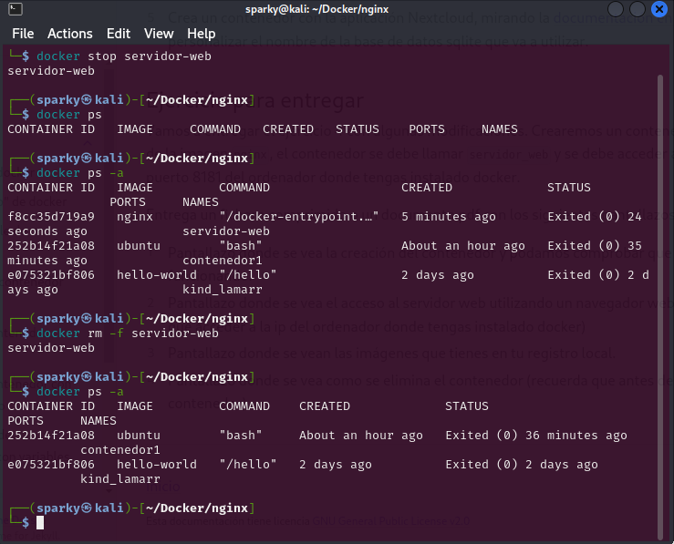

# PPS-Unidad0-Actividad5-Docker-JcMartin
*Aprendiendo "Docker" - Ejercicios Prácticos.

### Docker - Ejercicio 1

Crearemos un contenedor demonio a partir de la imagen nginx, el contenedor se debe llamar servidor_web y se debe acceder a él utilizando el puerto 8181 del ordenador donde tengas instalado docker.

Entrega un fichero comprimido o un documento pdf con los siguientes pantallazos:

#### 1.- Creación del Contenedor demonio nginx

Pantallazo donde se vea la creación del contenedor y podamos comprobar que el contenedor está funcionando.

#### 2.- Acceso al Servidor Web

Pantallazo donde se vea el acceso al servidor web utilizando un navegador web (recuerda que tienes que acceder a la ip del ordenador donde tengas instalado docker)

#### 3.- Imágenes en el repositorio local

Pantallazo donde se vean las imágenes que tienes en tu registro local.

#### 4.- Eliminación del contenedor

Pantallazo donde se vea como se elimina el contenedor (recuerda que antes debe estar parado el contenedor).

