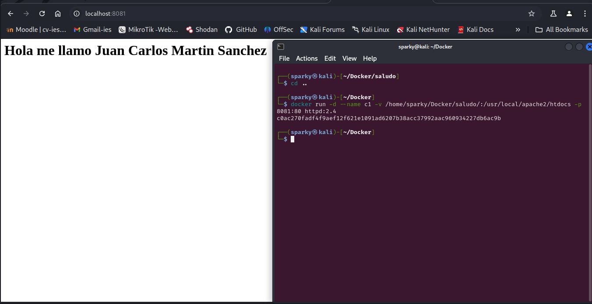
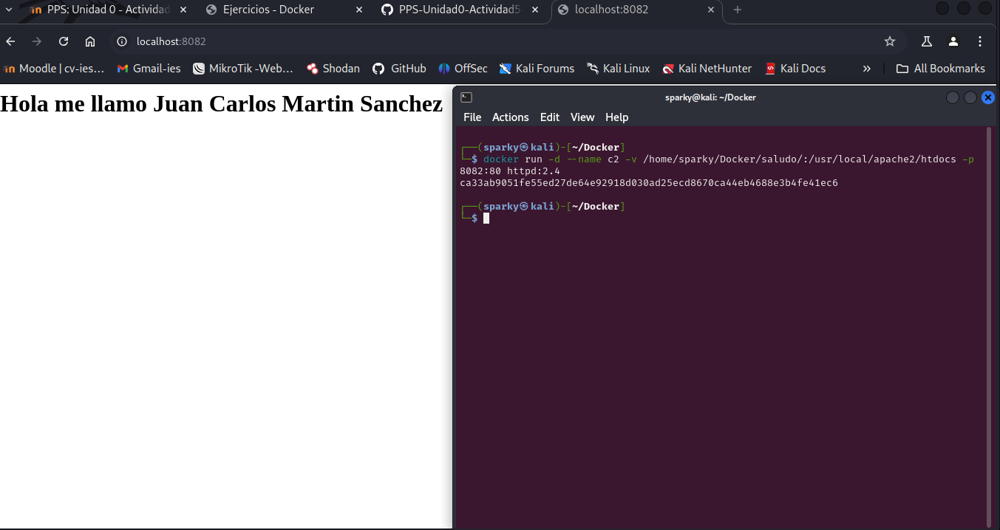
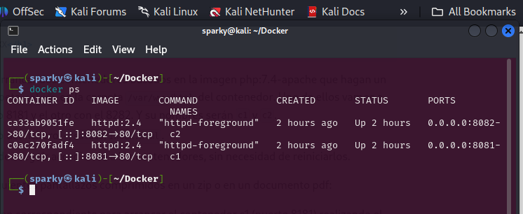
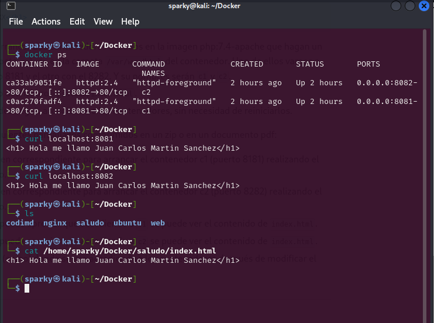
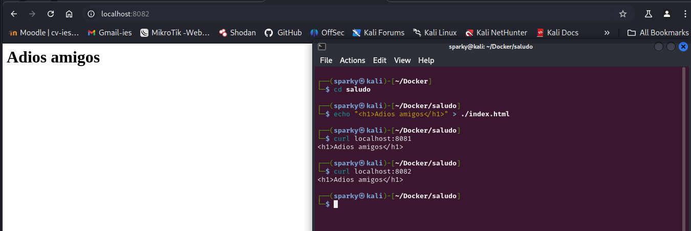

# PPS-Unidad0-Actividad5-Docker-JcMartin


Aprendiendo "Docker" - Ejercicios Prácticos.
======

[Anterior](./Ejercicio1.md)
[Ejercicio 2 - Almacenamiento](#Docker---Ejercicio-2)
[Siguiente](./Ejercicio3.md)


--- 


### Docker - Ejercicio 2

Arranca un contenedor que ejecute una instancia de la imagen ```php:7.4-apache```, que se llame web y que sea accesible desde tu equipo en el puerto 8000.
Colocar en el directorio raíz del servicio web (/var/www/html) de dicho contenedor un fichero llamado index.html con el siguiente contenido:

```html
<h1>HOLA SOY XXXXXXXXXXXXXXX</h1>
```

Deberás sustituir XXXXXXXXXXX por tu nombre y tus apellidos.

Colocar en ese mismo directorio raíz un archivo llamado ```index.php```con el siguiente contenido:

```php
<?php echo phpinfo(); ?>
```
Una vez hecho esto arrancar dos contenedores basados en la imagen php:7.4-apache que hagan un bind mount de la carpeta saludo
en la carpeta /var/www/html del contenedor.
Uno de ellos vamos a acceder con el puerto 8181 y el otro con el 8282.
Y su nombres serán c1 y c2.
Modifica el contenido del fichero ~/saludo/index.html.
Comprueba que puedes seguir accediendo a los contenedores, sin necesidad de reiniciarlos.

Deberás entregar los siguientes pantallazos comprimidos en un zip o en un documento pdf:


#### 1.- Mostrando el arranque del contenedor C1

Pantallazo con la orden correspondiente para arrancar el contenedor c1 (puerto 8181) realizando el bind mount solicitado.



#### 2.- Mostrando el arranque del contenedor C2

Pantallazo con la orden correspondiente para arrancar el contenedor c2 (puerto 8182) realizando el bind mount solicitado.




#### 3.- Accediendo a index.html de C1

Pantallazo donde se pueda apreciar que accediendo a c1 se puede ver el contenido de index.html.




#### 4.- Accediendo a index.html de C2

Pantallazo donde se pueda apreciar que accediendo a c2 se puede ver el contenido de index.html.


#### 5.- Modificación fichero index.html en ambos contenedores

Otro dos pantallazos (o uno) donde se vea accediendo a los contenedores después de modificar el fichero index.html.




[Inicio](#Docker---Ejercicio-2)
