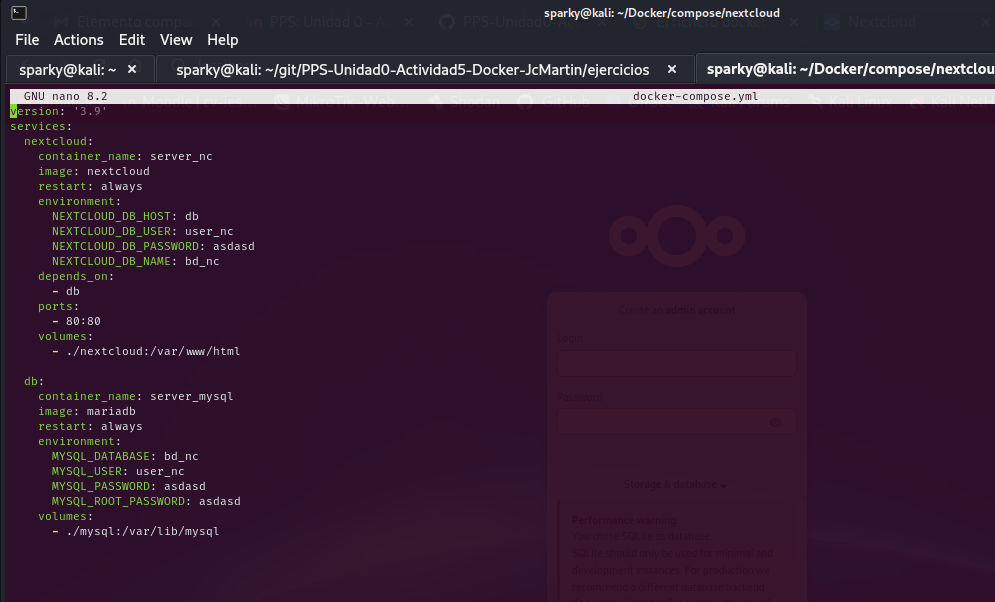
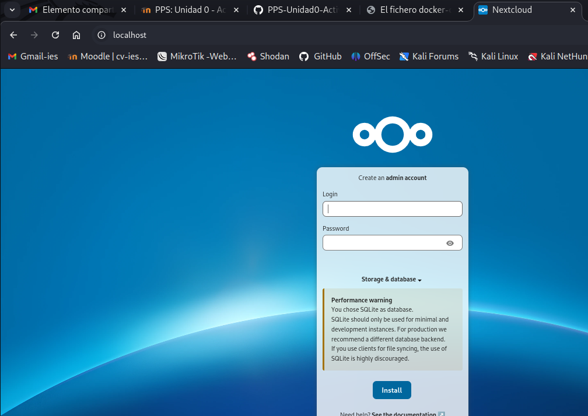

# PPS-Unidad0-Actividad5-Docker-JcMartin

Aprendiendo "Docker" - Ejercicios Prácticos.
======

[Anterior](./Ejercicio3.md)
[Ejercicio 4 - Multicontenedor](#Docker---Ejercicio-4)
[Siguiente](./Ejercicio5.md)

--- 

### Docker - Ejercicio 4

Vamos a desplegar la aplicación nextcloud con una base de datos (puedes elegir mariadb o PostgreSQL) utilizando la aplicación docker-compose. Puedes coger cómo modelo el fichero docker-compose.yml el que hemos estudiado para desplegar WordPress.

Instala docker-compose en tu ordenador.

#### Despliegue de Nextcloud

Dentro de un directorio crea un fichero docker-compose.yml para realizar el despliegue de nextcloud con una base de datos.

Recuerda las variables de entorno y la persistencia de información.
Levanta el escenario con docker-compose.

Muestra los contenedores con docker-compose.

Accede a la aplicación y comprueba que funciona.

Comprueba el almacenamiento que has definido y que se ha creado una nueva red de tipo bridge.

Borra el escenario con docker-compose.

Deberás entregar los siguientes pantallazos comprimidos en un zip o en un documento pdf:

#### Ejercicio 4.1 Docker-Compose

Pantallazo donde se vea el fichero docker-compose.yaml.

#### Ejercicio 4.2 Contenedores

Pantallazo donde se vea los contenedores funcionando con la instrucción docker-compose.

#### Ejercicio 4.3 Accediendo a Nextcloud
Pantallazo donde se vea el acceso desde el navegador a la aplicación 

[Inicio](#Docker---Ejercicio-4)
