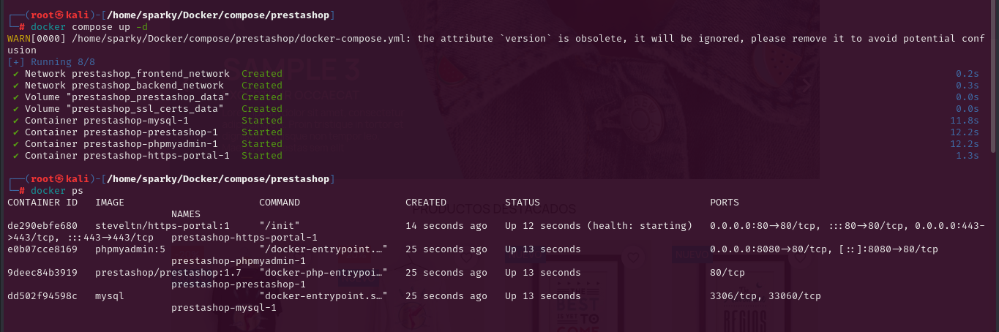
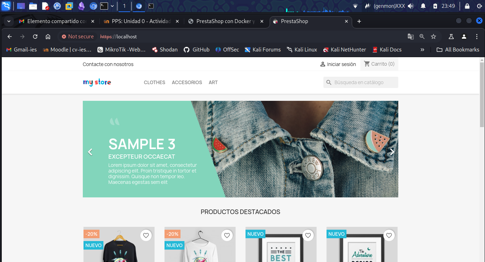

# PPS-Unidad0-Actividad5-Docker-JcMartin

Aprendiendo "Docker" - Ejercicios Prácticos.
======

[Anterior](./Ejercicio4.md)
[Ejercicio 5 - Fin Curso Docker](#Docker---Ejercicio-5)
[Inicio](./Ejercicio1.md)

--- 

### Docker - Ejercicio 5

Vamos a desplegar la aplicación de tienda virutal "PrestaShop" con una base de datos utilizando la aplicación docker-compose.
Puedes coger cómo modelo el fichero docker-compose.yml creado por bitnami.

Instala docker-compose en tu ordenador.

#### Despliegue de Prestashop - Bitnami

Dentro de un directorio crea un fichero docker-compose.yml para realizar el despliegue de prestashop con una base de datos.

Recuerda las variables de entorno y la persistencia de información.
Levanta el escenario con docker-compose.

Muestra los contenedores con docker-compose.

Accede a la aplicación por el puerto 80 de tu navegador y comprueba que funciona.

Comprueba el almacenamiento que has definido y que se ha creado una nueva red de tipo bridge.

Borra el escenario con docker-compose.

Deberás entregar los siguientes pantallazos comprimidos en un zip o en un documento pdf:

#### Ejercicio 5.1 Imágenes personalizadas

Pantallazo donde se vea el fichero docker-compose.yaml.

#### Ejercicio 5.2 Contenedores

Pantallazo donde se vea los contenedores funcionando con la instrucción docker-compose.

#### Ejercicio 5.3 Accediendo a Nextcloud
Pantallazo donde se vea el acceso desde el navegador a la aplicación 

[Inicio](#Docker---Ejercicio-5)
