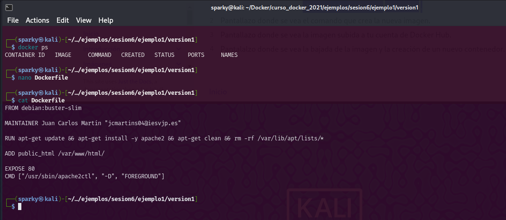
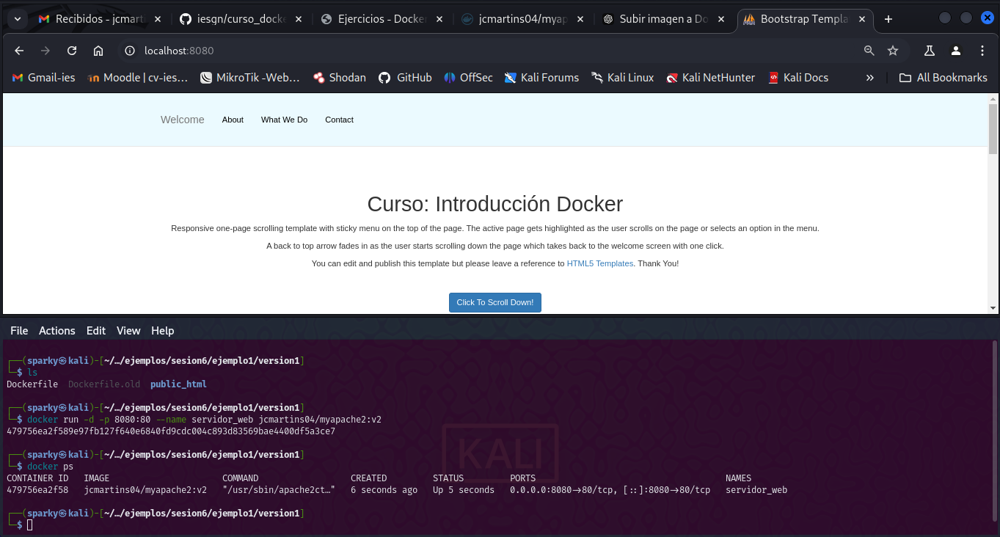
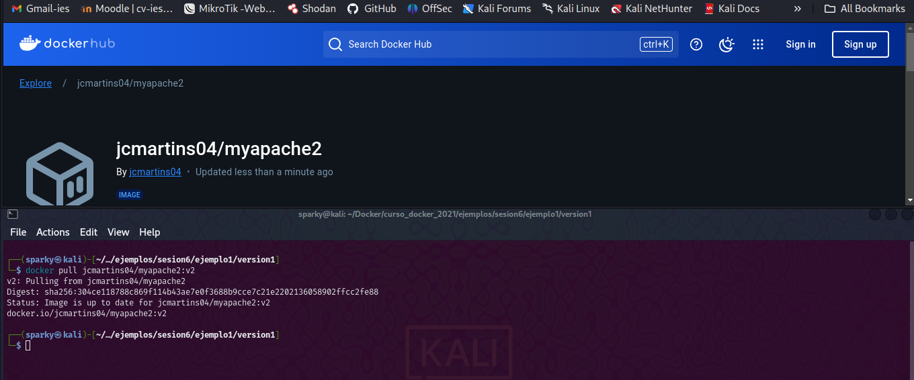
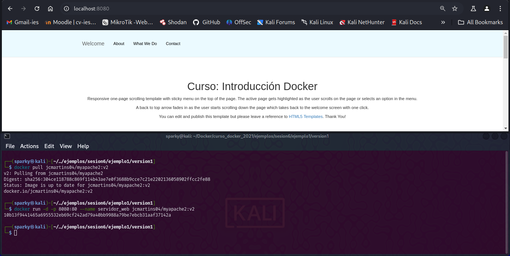

# PPS-Unidad0-Actividad5-Docker-JcMartin

Aprendiendo "Docker" - Ejercicios Prácticos.
======

[Anterior](./Ejercicio5.md)
[Ejercicio 6 - Fin Curso Docker](#Docker---Ejercicio-6)
[Inicio](./Ejercicio1.md)

--- 

### Docker - Ejercicio 6

Las imágenes Docker son paquetes inmutables que contienen todo lo necesario para ejecutar una aplicación en un contenedor. Esto incluye el sistema operativo base, bibliotecas, dependencias, archivos de configuración y el código de la aplicación. Se construyen a partir de un archivo llamado **Dockerfile**, que define las instrucciones para ensamblar la imagen, como instalar dependencias, copiar archivos y configurar la ejecución.

Las imágenes son ligeras y portables, lo que permite ejecutarlas en cualquier sistema que tenga Docker instalado, independientemente del sistema operativo subyacente. Además, son la base para crear contenedores, ya que cada contenedor es una instancia en ejecución de una imagen.

Las imágenes están compuestas por capas que Docker reutiliza para optimizar espacio y tiempo al construir nuevas imágenes. Esto significa que las imágenes comparten capas comunes, reduciendo redundancias.

Se pueden almacenar y compartir en registros como **Docker Hub** o repositorios privados, facilitando la distribución de aplicaciones. Además, las imágenes pueden versionarse mediante etiquetas, como `v1.0` o `latest`, para gestionar diferentes versiones de una aplicación.

#### Creación de Imágenes  - Docker Hub

Creación de una imagen a partir de un Dockerfile
Crea una página web estática (por ejemplo busca una plantilla HTML5). O simplemente crea un index.html.
Crea un fichero Dockerfile que permita crear una imagen con un servidor web sirviendo la página. Puedes usar una imagen base debian o ubuntu, o una imagen que tenga ya un servicio web, como hemos visto en el apartado Ejemplo 1: Construcción de imágenes con una página estática.
Ejecuta el comando docker que crea la nueva imagen. La imagen se debe llamar <tu_usuario_docker_hub>/mi_servidor_web.
Conéctate a Docker Hub y sube la imagen que acabas de crear.
Descarga la imagen en otro ordenador donde tengas docker instalado, y crea un contenedor a partir de ella. (Si no tienes otro ordenador con docker instalado, borra la imagen en tu ordenador y bájala de Docker Hub).
Deberás entregar los siguientes pantallazos comprimidos en un zip o en un documento pdf:

#### Ejercicio 6.1 Imágenes - Dockerfile

Pantallazo donde se vea el contenido del fichero Dockerfile.

#### Ejercicio 6.2 Nueva Imagen

Pantallazo donde se vea el comando que crea la nueva imagen.

#### Ejercicio 6.3 Docker Hub

Pantallazo donde se vea la imagen subida a tu cuenta de Docker Hub. 

#### Ejercicio 6.4 Nuevo Contenedor

Pantallazo donde se vea la bajada de la imagen y la creación de un nuevo contenedor.

[Inicio](#Docker---Ejercicio-6)
